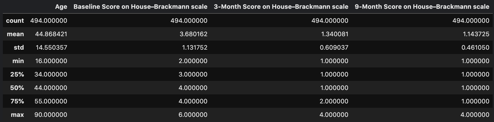
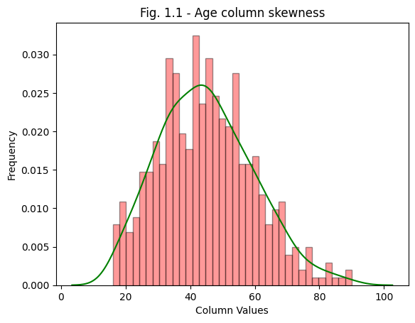

import { Callout } from "nextra/components";

# Case Study: Predicting Bell's Palsy clinical trial results

In this case study, I'll be using a synthetic dataset which contains patient-level clinical trial data and results and build a machine learning model and predict results.

The main techniques I'll be employing are:

0. Preparing the data (Cleaning, formatting, etc)
1. Chi-square test to find the relationship between control groups and outcomes
2. Using a KNN model to find similar patients using euclidean distance (Supervised learning)
3. Clustering patients using Unsupervised learning

### Description of the dataset

This is synthetic patient-level clinical trial data, re-created based on data from a clinical trial for corticosteroids and antiviral agents as treatment for Bell's Palsy: https://www.nejm.org/doi/full/10.1056/nejmoa072006#

Bell's Palsy is a sudden, temporary weakness or paralysis of the muscles on one side of the face. The exact cause is unknown, but it's believed to occur due to swelling and inflammation of the nerve that controls the muscles on one side of the face, which can be triggered by a viral infection.

The authors conducted a double-blind, placebo-controlled, randomized, factorial trial involving patients with Bell's Palsy who were recruited within 72 hours after the onset of symptoms. Patients were randomly assigned to receive 10 days of treatment with prednisolone, acyclovir, both agents, or placebo. The primary outcome was recovery of facial function, as rated on the House–Brackmann scale.

[Link to the dataset](https://www.kaggle.com/datasets/dillonmyrick/bells-palsy-clinical-trial)

**Note** this post is theoretical and is meant to serve as a walkthrough of my thinking and work process. To see the complete code, click [here](https://www.kaggle.com/has9800/clinical-trial-analysis/)

<hr />

## Part 0: Preparing the data

Let's start off by creating a dataframe using the data path provided

```python copy
df = pd.read_csv('path_to_data')
```

The first thing I check is to see whether a dataset has any null or missing values, followed by whether there are any duplicates in the data. This is done in the code below

```python copy
# checking to see if there are any null/missing values
df.isna().sum()

# checking for duplicates
df.duplicated().sum()
```

In this particular instance, there is no missing or duplicated data present in the dataset.

Next I'll be checking the data's descriptive statistics using `df.describe()` to see the standard deviation, as well as the mean, median, and percentiles

```python copy
df.describe()
```



The following code prints a table with useful statistics such as the min and max ages.

Something interesting I noticed is that the minimum age is 16, and the maximum age is 90. That's a significant range but could be common in clinical data as patients are typically from a wide range of ages.

Let's see how skewed the data in the `Age` column is:

```python copy
age = df['Age']

skewness = skew(age)
kurt = kurtosis(age)

print(f'Kurtosis: {kurt}')
print(f'Skewness: {skewness}')
```

`Kurtosis:` -0.17414481184860575 <br/>
`Skewness:` 0.36911675419062706

The code above prints the skewness of the data, as well as the kurtosis which is information on the data's tail. For better understanding, we could plot a histogram to visualize this (code example on visualization not provided)



In the histogram above, we could see the data looks almost perfectly symmetrical as excpected due to the skewness being such a low number. However, there's still a very slight positive skew to the right. This indicates outliers which could be further investigates using other methods such as scatter and box plots.

In this particular instance, the data seems to be almost perfectly symmetrical due to it being artifically generated but in a real world setting, this might not be the case.

<Callout emoji="🚧" type="warning">
  This page is still under development. Please check back soon :)
</Callout>
