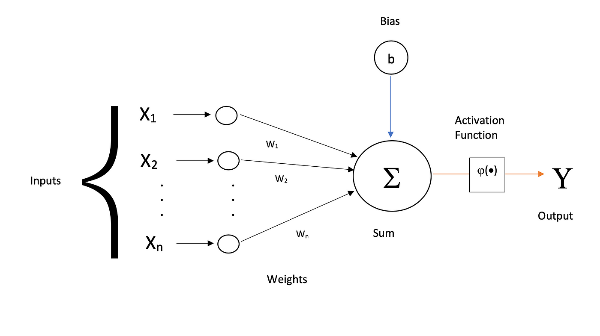
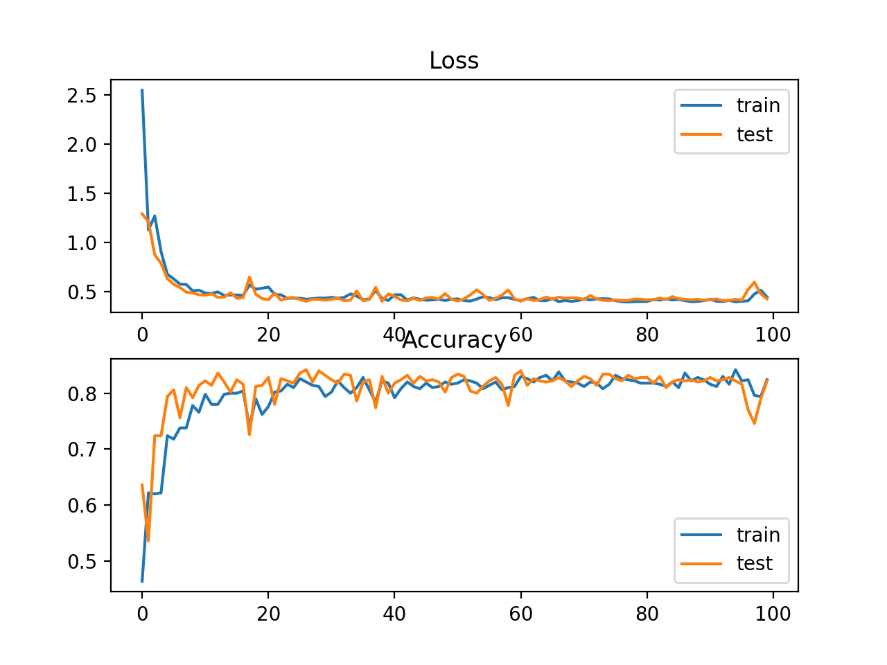

import { Callout } from "nextra/components";

# Building your first neural network

In this post, you'll build your first artifical neural network with me if you haven't already. Being self-taught myself, I know how important it is to make it as easy as possible to follow along while understanding what's going on under the hood.

Note this guide is more theoretical than practical but serves as a great reference for both you and I. I'll try my best to keep it simple.

**Prerequisites**: Basic understanding of Python.

<hr />

### Contents

1. What is a neural network
2. Building your first model

## 1. What are neural networks?

Neural networks contain the building blocks of AI. The neurons. One might make the comparison between aritifical neurons and biological neurons that make up our brain, while the idea of artificial neurons might have been the insipiration for artifical neurons, they're not exactly the same. The comparison and differences between the two are beyond the scope of this guide.

Artifical neurons take in some input and _weights_, apply an _activation function_ to it, and then relay that to the next layer of neurons. I've introduced new terminology so let's break them down.

### 1.1 What are _weights_?

In the introduction above, I've said neural networks contain the building blocks of AI. To be more specific, neural networks are actually comprised of layers, which are then comprised of neurons. Some models may have just 3 layers, some may contain more in the real world. It varies by use case and depends on other factors as well. Generally speaking, a deep learning model needs at least 3 layers minimum.

Now since we've established the fact that neural networks are made up of layers, let's establish the fact that layers are made up of interconnected neurons. These connections have what we call weights and biases.

Weights determine the strength and relevance of a connection between neurons, and also between layers. During training, it is these weights that the model optimizes in a process called "back-propagation".

Biases are a constant number applied to the neuron and act as a sort of baseline activation. (More on this later)

### 1.2 Visualizing a neuron

For those of us who are visual learners, let's take a look at the illustration of a neuron below.



I'll explain what's depicted above. Moving from left to right, we could see there's 'inputs'. These inputs are labeled _x_. These inputs are where the data from the features, or simply referred to as columns are passed through in the inital stage. As you move through left to right, the output is labeled _y_.

You might be wondering what happens in between. There's a lot of math and algorithms that goes on in between layers, as well as within a neuron itself.

_W1_, _W2_, ..., _WN_ refers to the weights we discussed above. All of the connected weights are calculated along with the bias you could see added in.

The final step involved in this calculation process within a neuron is to apply what's called an ['activation function'](https://www.v7labs.com/blog/neural-networks-activation-functions#:~:text=An%20Activation%20Function%20decides%20whether,prediction%20using%20simpler%20mathematical%20operations.) before outputting the final result to the next connected layer of neurons.

In short, activation functions introduce something called 'nonlinearity' into the network. Nonlinearity is important because it helps capture complex patterns and make accurate predictions in real world problems. More on this in a later topic.

### 1.3 Visualing neural network layers

Now that we've established basic understanding of what neurons are, let's focus on neural network layers to see how neurons interconnect and function.


Let's break down this final step in visualizing a neural network. As you could see, the neural network depicted above contains many layers. I've mentioned how a neural network must consist of 3 layers minimum. This is because there MUST be an input layer, an output layer, and at least 1 hidden layer. However, you could also use as many hidden layers as you want to capture more patterns within the data which increases the model's performance but this could also lead to problems with the overcomplexity of the model and actually hurt performance.

1. The input layer
2. Hidden layers
3. The output layer

The input layer acts as the gateway to the neural network where the data inputs flow. Hidden layers are called 'hidden' because the weight optimizations that occur during training are not directly visible. Finally, the output layer is self explanatory and outputs the results or predictions.

**Note** the shape of the input layer must match the number of features (columns being used to train) present in a dataset, while the output must also match the targets (number of classes to predict in the case of multi-class and binary classification, or 1 output node for linear regression in a time series model). More on this later as well.

The network takes data in from the input layer and learns the patterns within the data and optimizes it's weights during training before outputting the result. This type of neural network is called a _'feedforward network'_ as data passes forward between layers, but uses something called _'backpropagation'_ to pass data back to the early layers to capture more of the patterns in the data (a sort of loop) and optimize it's weights to output accurate predictions.

## 2. Building a model

Now that we've established a baseline understanding of the components involved in a neural network and how it functions, let's take a look at some code.

Before diving in however, I want to explain why we'll be using our framework of choice in the code examples below. Mainly the differences and nuances between machine learning libraries and deep learning frameworks.

As a beginner, there's two options to use in building predictive models. Scikit-learn, and Keras. Both widely popular, but for specific use cases.

Scikit-learn is a machine learning library with algorithms you could use to build supervised and unsupervised learning "models". These are easier to train and are very effective in most cases. However, you typically don't use this library to build neural networks.

Keras on the other hand is more of a deep learning framework you would use to build neural networks. It's more hands on than scikit-learn and requires more attention to detail, as well as extra steps needed to build a suitable model.

Personally, I don't refer to "models" built using scikit-learn as AI models, I refer to them as algorithms as they don't build on top of the deep learning archtitectures used in Keras or Pytorch for example. As for Keras, I refer to them as models. This is only my personal opinion though.

I'll be using Keras in this guide to build the barebones of a simple neural network to show how this is done in code. I'll start by importing a few things from Keras and will explain what they are and why they're used afterwards.

### 1.1 Importing packages

```python {7} copy

from keras.layers import Dense
from keras.optimizers import Adam
from keras.callbacks import EarlyStopping
from keras.models import Sequential

from sklearn.model_selection import train_test_split

```

Let's break down what we're importing and why they're useful.

To start with, as we've discussed, neural networks are made up of many connected layers. In Keras, these layers are referred to as 'Dense' layers. This is because they're fully connected as we've discussed. Each neuron in a layer is connected to other neurons in other layers.

The other imports such as Adam and EarlyStopping will be explained shortly.

I'm also importing the Sequential model which is what allows us to build those feedforward networks I mentioned earlier. In short, it allows us to build models that take data in from the input, pass them through the hidden layers, and then finally outputs the results in a sequence.

Finally, I'm importing `train_test_split` from scikit-learn to split our imaginary dataset into 'training' and 'testing' which is a very important step in training ai models. This allows us to train a model on a portion of the dataset, while reserving the rest to test our model and see how accurate it is. I highlighted that import to show that since I've decided to use Keras in this guide instead of Scikit-learn, we could use the two together without problems, and more often than not, will have to be used together since scikit-learn has valuable tools.

Let's move on.

```python

X = df.drop(labels='class', axis=1)
y = df['class']

X_train, X_test, y_train, y_test = train_test_split(X, y, train_size=0.8, random_state=4)

```

Above, I'm using our imaginary dataset to assign X to the features (columns relevant to us that we want to use), and y to the labels (ie type of flower we want to predict an image belongs to) provided in the dataset.

I'm then using `train_test_split` to split the dataset into training and testing portions, passing in X and y as the first parameters. If you look at the `train_size` parameter, I'm using `0.8` to tell the function to reserve 80% of the data for training, and 20% for testing.

The random seed parameter is used to keep everything replicable. Nothing more.

```python /df.num_classes/ copy

model = Sequential([
	Dense(32, activation='relu', input_shape=df.num_classes),
	Dense(32, activtion='relu'),
	Dense(16, activation='relu'),
	Dense(1, activation='sigmoid')
])

stop_early = EarlyStopping(patience=3, restore_best_weights=True)

model.compile(Adam(learning_rate=0.001), loss='binary_crossentropy', metrics=['accuracy'])

model.fit(X_train, y_train, validation_split=0.2, epochs=15, batch_size=30, callbacks=[stop_early])

```

In the code example above, it might seem complex at first but lets simplify it. We've created a Sequential model with 4 Dense layers. The first layer is the input layer. It's the only layer in which the `input_shape` is passed as a parameter.

If you remember, I mentioned how the shape of the input layer must match the number of features (columns). For example, if my dataset has 8 columns (aside from the target column we're trying to predict), then the input shape must be 8 as well, and passed to the first layer as shown above in highlight. The reason why I'm using `df.num_classes` instead of 8 is because it's a good practice but still the same thing.

We've also touched on activation functions briefly. They introduce nonlinearity to allow the model to capture complex patterns. There are different types of activation functions such as reLU, sigmoid, tanh, and so on. I won't explain these functions in depth as it would bloat up this guide. One thing to note however is that the reason why I'm using the `signmoid` activation function in the last layer (output) is because the last layer's activation function will vary depending on the problem the model was built for. In this case, it's a simple binary classification model.

Binary classification is when you want to predict something that is of either or type. For example, classifying whether images are of cats or dogs.

There's a few things I want to explain further:

1. EarlyStopping
2. The Adam optimizer
3. The loss function

### 1. EarlyStopping

The EarlyStopping method is used to stop a model's training early if the model's ability to learn is worsening. As you could see, the `patience` parameter ensures that if the model worsens over the span of 3 tries, training is stopped immediately. I've also used the `restore_best_weights` parameter to restore the most accurate weights the model has learned.

### 2. Adam optimizer

In the earlier sections, I've mentioned how the model optimizes it's weights in the backpropagation process. That's how the model learns essentially.

The way it optimizes it's weights is by using something called an optimizer. It's essentially a function that uses sophisticated math under the hood but that's beyond the scope of this guide. In our case, I'm using the Adam optimizer but there's also other optimizers available. Each optimizer uses a different approach to achieve the same goal. We pass it a learning rate which is basically the rate at which it readjusts it's weights. For more info on this, also check out how gradient descent works as you'll have a better idea of the optimization and backpropagation process in general.

### 3. The loss function

As I've mentioned before, we use binary classification when we want to predict between 2 types of things. It could be between dogs or cats, airplanes or birds, or any two items. What a loss function essentially does is it calculates the discrepancy between the predicted values and the actual values. The higher the discrepancy, the lower the accuracy.

After building the model, we apply the `compile` method to the model to compile it for training. Finally, we use the `fit` method to train the model. This is where all the processing and training happens. We pass in the training data `X_train` and the training labels we want to predict `y_train`, followed by the number of epochs, batch size, and callbacks (early stopping). Epochs is the number of iterations the model will retry the training process in attempt to get better at learning the patterns in the data, while the batch size refers to the number of samples in each epoch the model will use. More on this later.

Now that we have the model built and trained, all we need to do is evaluate it's accuracy.

When we're evaluating a model's accuracy, there's tools we could use such as Scikit-learn's `classification_report` method that generates f1 scores and accuracy scores. However, when dealing with deep learning neural networks, there's 2 crucial metrics we measure by using a chart.

1. Loss curve
2. Accuracy curve

The loss curve shows us the loss calculated with each epoch (iteration) using the `binary_crossentropy` loss function method above, while the accuracy curve shows us how accurate the model gets with each epoch (iteration.) Example below.



The `y` axis in both charts refers to the number of epochs (iterations) the model goes through and shows us the progress in each epoch (iteration), from 0 to 100 epochs (iterations)

<Callout emoji="🚧" type="warning">
  This page is still under development. Please check back soon :)
</Callout>
